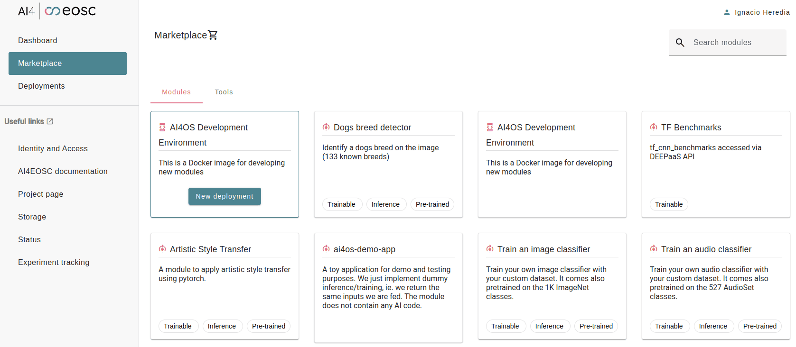
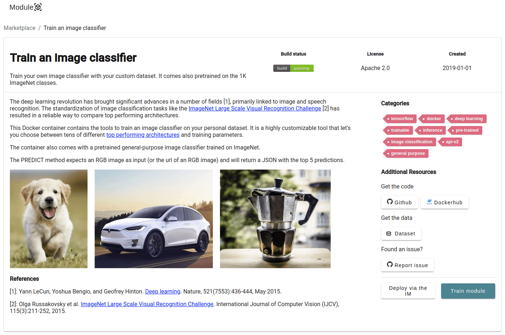
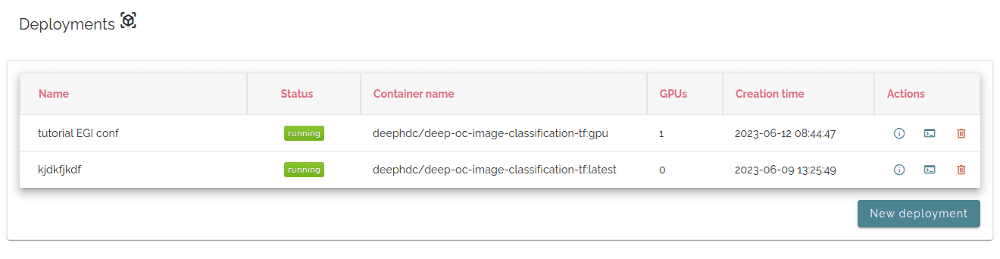

AI4OS Dashboard
===============

The AI4OS dashboard allows users to access computing resources to deploy, perform inference,
and train modules hosted at the Marketplace.
The Dashboard simplifies the deployment and hides some of the technical parts that most
users do not need to worry about.

Currently, the following platforms have deployed a version of the AI4OS Dashboard.
You should access one of those Dashboards depending on the project you are a member of:

* `AI4EOSC Dashboard <https://dashboard.cloud.ai4eosc.eu/>`_
* `iMagine Dashboard <https://dashboard.cloud.imagine-ai.eu>`_
* `Tutorials Dashboard <https://tutorials.cloud.ai4eosc.eu>`_

The Dashboard has a two views:

* a **public view** that let's you browse through the modules
* a **private view** that additionally allows you to make deployments based on those modules.
  To access this view you need :doc:`authentication <auth>`.

In the remaining part of this doc we will assume you have access to this private view.

Selecting the modules
---------------------

Once you log into the Dashboard, you are able to see all possible modules for deploying
in the ``Modules (Marketplace)`` panel.
Those are basically:

* all the Marketplace modules.
* ``AI4OS Development Environment``: special module especially designed to develop new modules.

Modules can be:

* **Trainable**: Those are modules that an user can train on their own data to create a new service. Like training an
  `image classifier <https://dashboard.cloud.ai4eosc.eu/modules/DEEP-OC-image-classification-tf>`__ with a
  plants dataset to create a `plant classifier <https://dashboard.cloud.ai4eosc.eu/modules/DEEP-OC-plants-classification-tf>`__
  service.
  Look for the ``trainable`` tag in the marketplace to find those modules.

* **Trained (inference-ready)**: Those are modules that have been pre-trained for a specific task (like the
  `plant classifier <https://dashboard.cloud.ai4eosc.eu/modules/DEEP-OC-plants-classification-tf>`__ mentioned earlier).

Some modules can both be trainable and trained.
For example the `image classifier <https://dashboard.cloud.ai4eosc.eu/modules/DEEP-OC-image-classification-tf>`__
can be trained to create other image classifiers but can also be deployed for inference as it comes pre-trained with a
general-purpose image classifier.

Making a deployment
-------------------

Once you choose the module, you will be presented with the module's information:

To deploy click in ``Train module`` and you will be redirected to a configuration page.

.. image:: ../../_static/images/dashboard-configure.png

This page will allow you to configure mainly three aspects:

* **General configuration**, including the service to run and Docker tags.
* **The computing resources** of the new deployment. A user can select multiple CPUs and GPUs, the machine RAM as well as
  optionally choosing the physical site where the machine must be deployed.
* **The remote storage options**, like tokens for authentication with Nextcloud.

Use the :fa:`toggle-on` ``Show help`` toggle to view additional info about the fields to fill.

Once you are happy with the state of your configuration, click ``Submit`` and you will
be redirected to the page listing all the current deployments.

General configuration
^^^^^^^^^^^^^^^^^^^^^

The parameters to configure are:

* ``Deployment title``: short name/sentence to quickly identify your deployment.

* ``Deployment description``: longer description of your deployment.

* ``Service`` determines which service to launch:

  - For performing simple inference, ``DEEPaaS`` is the recommended option, as no code changes are required.
  - For retraining a module, ``JupyterLab`` is the recommended option, as it offers access to Terminal windows which are needed to mount remote data into your machine.
  - For developing a new module, ``JupyterLab`` is the recommended option, as it offers the possibility to directly interact with the machine to write code.
    Some modules might offer also ``VScode``.

  If you select either ``JupyterLab`` or ``VScode`` you must set a password at least 9 characters long.

.. important::
  We do not provide the option to run both JupyterLab and DEEPaaS at the same time,  as code changes performed subsequently via JupyterLab wouldn't be
  reflected in DEEPaaS (which is launched with the initial codebase), thus potentially leading to confusion.

  If you want to have access to both services in the same deployment, launch with JupyterLab.
  In JupyterLab, open a **Terminal** window (:fa:`square-plus` (New launcher) ➜ **Others** ➜ **Terminal**).
  Then run ``deep-start --deepaas`` to launch DEEPaaS.
  If you make subsequent code changes, you will have to kill the old DEEPaaS process and launch a new one.

* ``Hostame``: select a custom name to access your services (eg. selecting  ``my-custom-name`` will make your service available under ``http://deepaas.my-custom-name.deployments.cloud.ai4eosc.eu`` if the address is available)

* ``Docker tag`` selects the appropriate Docker tags of your module (tags may vary across modules).
  You should choose Docker tag that match with the hardware you selected in the previous step.
  So if you selected a CPU, look for ``latest`` or ``cpu`` tags.
  If you selected a GPU, look for ``gpu`` tag.

Hardware configuration
^^^^^^^^^^^^^^^^^^^^^^

Choose the hardware type to run on:

* For inference and code development, we recommend using ``CPU`` as they are low intensity tasks.
* For (re)training, we recommend using ``GPU`` as this is a more demanding task.

Storage configuration
^^^^^^^^^^^^^^^^^^^^^
This is where you have to provide the **rclone** credentials to be able to mount your Nextcloud directory in your deployment.
:ref:`Go here <user/howto/rclone:Configuring rclone>` in order to find how to create them.

Managing the deployments
------------------------

In the ``Deployments`` tab you have a view of all the deployments you have made so far:

Under the ``Access`` button, you will find the URLs for:

* ``DEEPaaS`` , only accessible if you launched with the DEEPaaS command or launched JupyterLab then ran DEEPaaS.
* ``IDE`` , only accessible if you launched with the JupyterLab or VScode command
* ``Monitor`` : this is the training monitoring page. Only accessible if the module has been coded to explicitly
  display monitoring (check the module's README or training arguments) and if a training is currently running.

Under ``Info`` you will find details about your deployment such as UUID, hardware, error messages, etc.

.. important::
  GPUs are scarce resources, so we kindly ask you to limit the number of GPUs you are using
  to at most 1 per user (2 if **really** needed). Take into account that sometimes even failed
  created/deleted deployments might be consuming resources, so don't forget to delete them.

  And remember to do periodic review of your deployments (either CPU or GPU) to delete the ones you no longer use.
